The [AWS Billing Dashboard](https://console.aws.amazon.com/billing/) helps you monitor your spending with customizable billing and usage alerts. In this tutorial, we will set up example billing alerts and configure them to send a combination of email, Slack, and push notifications. 

## Overview

Periodically during the day, the AWS billing system computes your current bill. At the end of each month, the owner of the account will receive an invoice and that invoice is paid. This is usually done automatically via credit card. If you are the account owner or access to an IAM account with billing console privileges, you can set up rules that will send notifications under certain billing conditions. Those notifications can be sent over email, or you can send them to other communications channels. In that case, you will need to create an Amazon SNS topic to receive the notifications and you will need to set up a consumer for the SNS notifications. In this tutorial, we will be using a Slack channel as the consumer, but you can do a lot of other interesting things. For example, you could use [IFTTT](https://ifttt.com/) to turn your IoT-enabled desk lamp a certain color depending on your budget status!

Here are the steps we’re going to take to get our first billing notification to Slack up and running: 

1. Get oriented to the AWS Billing Dashboard
2. Create an Amazon SNS topic for your budget notifications
3. Configure an AWS Chatbot that can post messages sent to your SNS topic to a Slack chanel
4. Create a Budget in AWS Billing Dashboard with an alert threshold

We’ll iterate on this a couple more times to illustrate some helpful patterns you can implement.
* * *

## Access the AWS Billing Dashboard

Before we dive into budgets and notifications, let’s get oriented to the AWS Billing Dashboard. If you are familiar with it, feel free to [skip ahead](https://quip-amazon.com/nxhwA8G3waCY/Setting-Up-Budgets-and-Billing-Alerts-on-AWS#temp:C:TYZ419ca03505d94606bb8ffa55e). 

Start by logging onto the [AWS Console](https://console.aws.amazon.com/). 

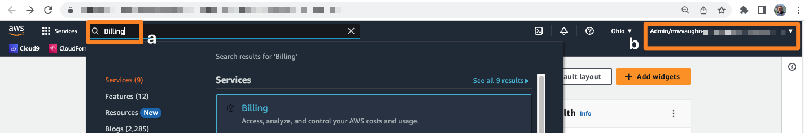

You can get to the AWS Billing Dashboard in two ways. First, you can just search for **Billing** in the query box (a). Or, you can choose the AWS account menu (b), then choose choose **Billing Dashboard**. Both options take you to the AWS Billing Dashboard. 

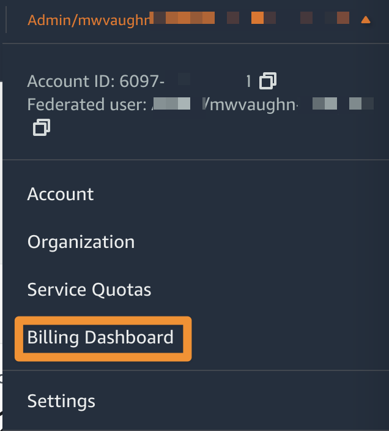

### Example AWS Billing Dashboard

Here is an example billing dashboard. Some highlights are the forecasted spend (a), the month-to-date balance (b), and the previous month balance (c). We will be using **Budgets** and **Budget reports** (d) to set up custom notifications.

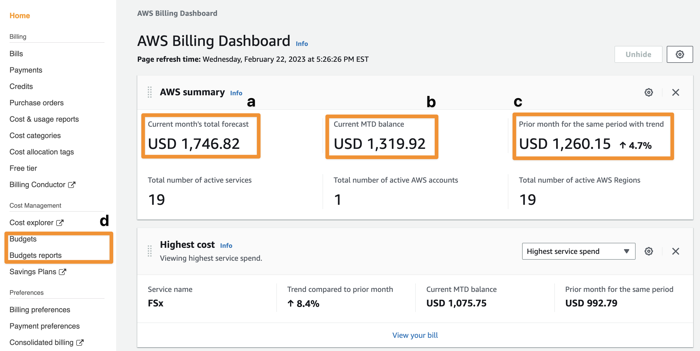

If you only want to set up email notifications, you don’t need to configure an Amazon SNS topic or Slack integration. You can proceed directly to the section on [setting up budgets](https://quip-amazon.com/nxhwA8G3waCY/Setting-Up-Budgets-and-Billing-Alerts-on-AWS#temp:C:TYZ6aab5e8d5d924cd8a972c9212).
* * *

## Setting up Amazon SNS and Slack Integration

You will be using two AWS services together: [Amazon SNS](https://aws.amazon.com/sns/) and [AWS Chatbot](https://aws.amazon.com/chatbot/). Amazon SNS is a cloud-based web service that delivers push messages. But, it’s designed to help computers talk to one another, so the format of SNS messages is often not very readable or understandable by people. To help with that, we’re going to create a Slack bot that listens to Amazon SNS and turns the messages it gets from the AWS Billing Dashboard into chat messages you can read. 

### Create an Amazon SNS topic

You need to create an Amazon SNS topic. Think of a topic like a mailbox or sorting tray for SNS messages. You can have many SNS topics, and each SNS topic can have many subscribers. A subscriber is a process or service that waits for a message to arrive in the SNS topic then takes action on it. If you have an SNS topic with two subscribers and you send a message to it, both subscribers can receive (and act on) it at once. This is an example of a software pattern known as *publish/subscribe* (pub/sub). It is a very powerful building block for reliable distributed systems.

Open the [Amazon SNS Console](https://console.aws.amazon.com/sns/v3/home). Then, in the navigation sidebar, choose **Topics**. Choose **Create Topic** and select the Standard type of topic. Enter a **Name** for your topic such as “budget-topic-001”. Optionally, you can provide a more descriptive **Display name** for the topic as well. Choose **Create topic**. 

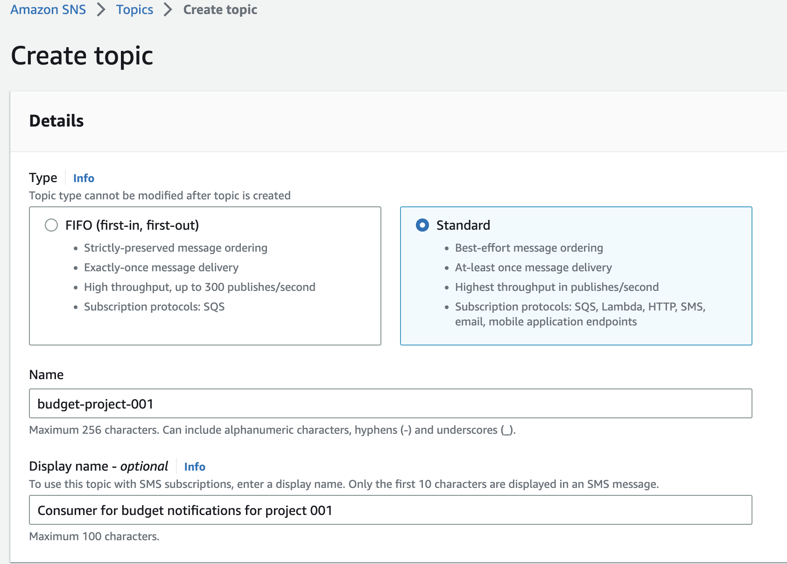

🚨But wait, **you’re not done**! You need to configure the *access policy* for your new topic. If you don’t do this, messages will not flow from the billing console to your downstream Slack integration. 

Navigate to your new topic in the AWS SNS console. Copy the ARN for the topic. It will look something like `arn:aws:sns:us-east-1:012345678901:budget-project-001`.

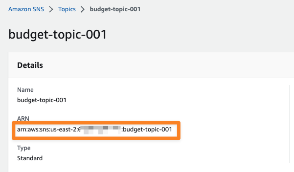

Next, choose **Edit,** then choose **Access policy**, then choose **Advanced.** You will see a JSON text field, which you will need to edit. After the characters `Statement": [` add a JSON dictionary modeled on this example, but with some changes. 

1. Replace the value of `Resource` with the ARN for your Amazon SNS topic.
2. The 12-digit ID `012345678901` is an example AWS account number. Replace it with your own account number everywhere in the document.
3. Make sure you’ve included the trailing comma, since you are adding a new JSON dictionary to an existing list named `Statement`. 

We’ve highlighted the text you need to edit in **bold text**. Choose **Save changes** when you are done editing. 

```json
{
  "Sid": "AWSBudgetsSNSPublishingPermissions for **012345678901**",
  "Effect": "Allow",
  "Principal": {
    "Service": "budgets.amazonaws.com"
  },
  "Action": "SNS:Publish",
  "Resource": "**arn:aws:sns:us-east-1:012345678901:budget-project-001**",
   "Condition": {
        "StringEquals": {
          "aws:SourceAccount": "**012345678901**"
        },
        "ArnLike": {
          "aws:SourceArn": "arn:aws:budgets::**012345678901**:*"
        }
      }
}
```

If you want to learn more about Amazon SNS topic access policies, they are covered in detail in the AWS Billing and Cost management [documentation pages](https://docs.aws.amazon.com/cost-management/latest/userguide/budgets-sns-policy.html).

### Configure an AWS Chatbot

Now, you need to create a subscriber for your Amazon SNS topic. This will be an [AWS Chatbot](https://aws.amazon.com/chatbot/) that can send messages to a Slack channel that you have access to. 

Why do we need to create a chatbot? Strictly speaking, we don’t, but we do need some way of translating the messages in the SNS topic to a format that Slack can understand. That’s because Amazon SNS messages look something like this:

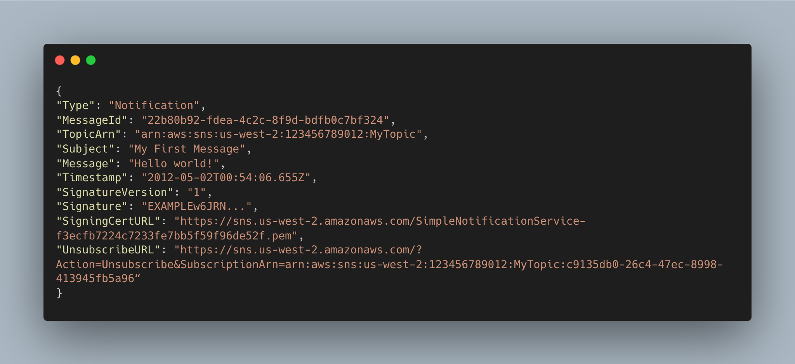

Not compelling reading is it?

#### Integrate AWS Chatbot with Slack

One way of doing the translation is to have an AWS Lambda function that subscribes to an Amazon SNS topic, converts messages it receives to the Slack API format, then transmits them on to the Slack. But that’s decidedly more programming than we need to do today. Instead, we can rely on AWS Chatbot. This service can communicate with Amazon Chime, Microsoft Teams, and Slack communications systems without your having to learn their API implementation details. Instead, it’s just a few actions in the AWS Console to set up communications. 

Open the [AWS Chatbot console](https://console.aws.amazon.com/chatbot/) and choose **Configure new client**. You will be directed to a Slack-operated page to authorize the connection between AWS Chatbot and your Slack workspace. If you have multiple workspaces, you can select among them using the workspaces toggle (a). To allow the connection, choose **Allow** (b). 

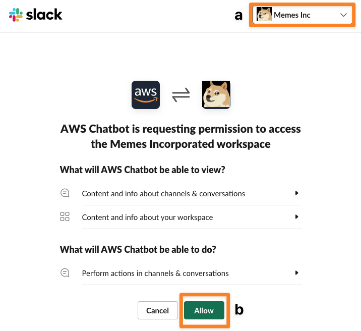

Now, you configure a channel. In the AWS Chatbot console, choose your workspace name under **Slack**. Then, choose **Configure a new channel**. Under **Configuration details**, give your configuration a distinctive name. Then, provide the **Slack channel ID**. 

The Slack channel ID is not the name of the Slack channel but its globally unique identifier. Here’s how to find it. Go into your Slack workspace and open the channel where you want to post messages. Here, we demonstrate with a channel called **hpc-dr-slack-bots**. Choose the channel name (e) at the top of the Slack window to get the channel details. At the bottom of the channel details pop-up window, find the **Channel ID** (f) and copy it.

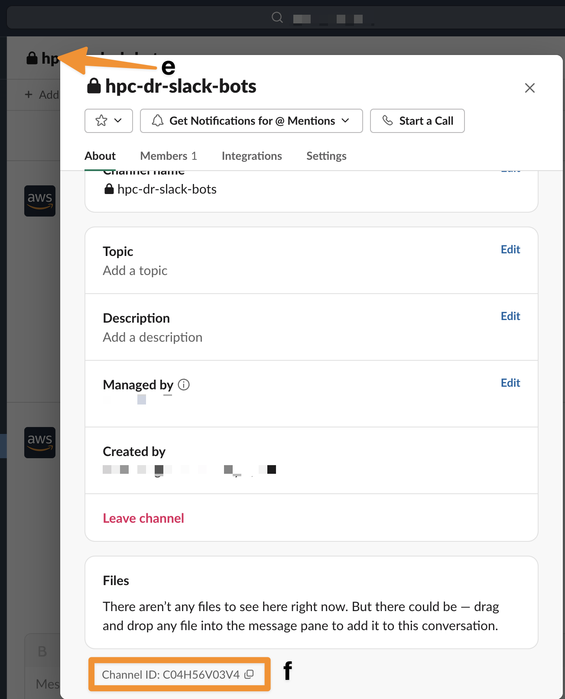

Back in the AWS Chatbot console entry for your new channel, paste the channel ID into **Channel ID** under **Slack channel.** Now, either select an existing IAM role for AWS Chatbot to assign or create a new IAM role. If creating a role, give it a distinctive name such as *MyAWSChatbotRole*. Configure a **Channel guardrail policy**. Since we don’t want the Slack channel to have any ability to take action on this AWS account, choose **ViewOnlyAccess**.

Under **Notifications** choose the AWS region where your SNS topic(s) was created. Next, choose the topic or topics you wish to connect to the Slack channel. Now choose **Configure**. This will take you back to the Slack workspace configuration, but now your channel configuration will show up under **Configured channels.** Choose the new channel. Now, choose **Send test message**. You will get a success message in the console if all is configured appropriately.

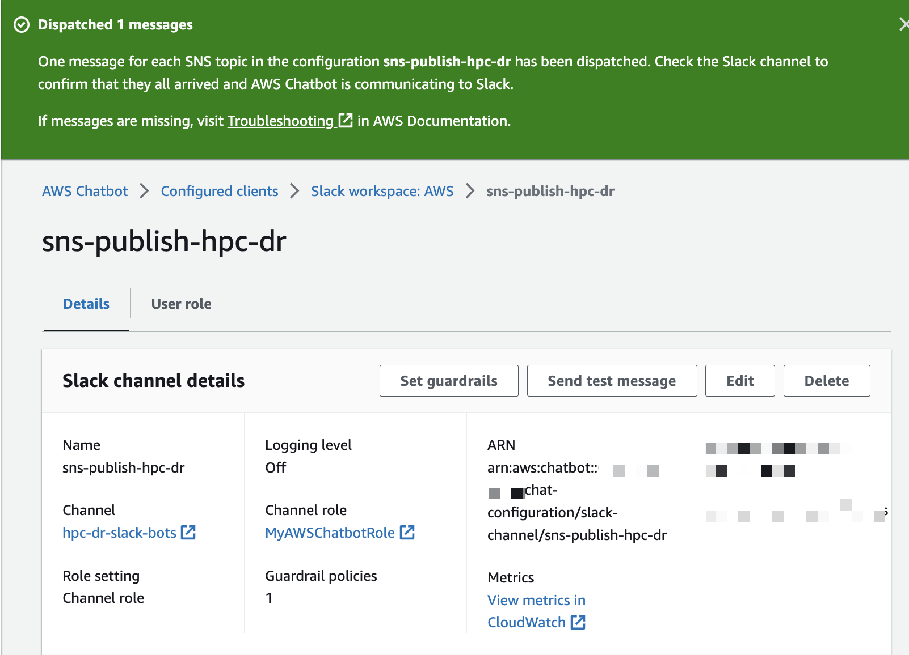

The real test, however, is whether the message showed up in Slack. Go back to your workspace, go to the appropriate channel, and look for a message that looks like this. 

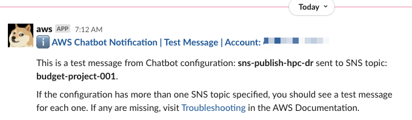

If it worked, congratulations - you’ve just added to your own Slack inbox overload 🏆. 

If it did not work, especially if you do not directly own the Slack workspace you are connecting to AWS, you may need to ask someone with administrative privileges to help you out with this setup. 
* * *

## Create a Budget in AWS Billing Dashboard

Navigate to the **[AWS Billing Dashboard](https://console.aws.amazon.com/billing/home/),** then choose **Budgets** from the navigation menu on the left. Select **Create a budget**. Under **Choose budget type**, select **Customize (advanced)**. Then, under **Budget types**, choose **Cost budget - recommended**. Finally, choose **Next**.

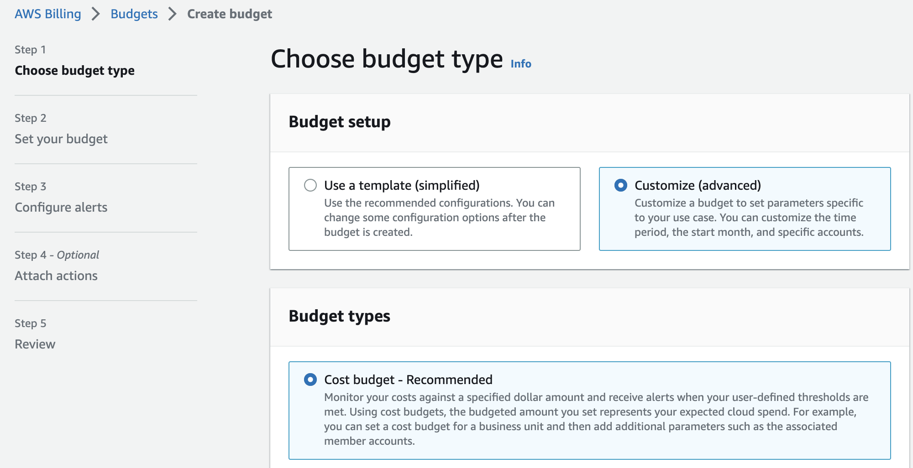

On Step 2 of the Create budget wizard, under **Details**, give your budget a distinctive name. This name can show up in messages and email notifications, so consider making it informative as well. In this example, we are setting up a monthly budget, so we have named it *Monthly - Special project Y*.  Under **Set budget amount,** select **Monthly** from the **Period** menu. Choose the Recurring budget renewal type and choose a **Start month**. Keep the **Budgeting method** as **Fixed**. Enter your **budgeted amount** of AWS spend for the month, such as $100.00.


Under **Budget scope**, choose **All AWS services** unless you have a reason to omit specific aspects of AWS expenditure. Leave the **Advanced options** as their default values and choose **Next**. 

You will taken to the **Configure alerts** page. Choose **Add an alert threshold**. Let’s start with a guardrail notification that will both email and send a Slack message when your actual monthly bill meets or exceeds 80% of the budgeted amount. In other words, this notification will be triggered every day your pending monthly bill is $80 or more. 

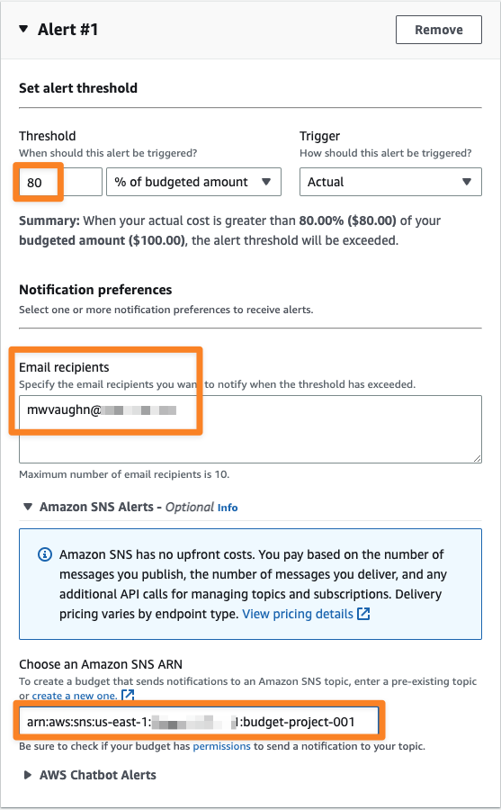

Under **Threshold**, enter **80**. Add one or more email addresses under **Email recipients**. Then, if you elected to set up an Amazon SNS topic as outlined above, paste the ARN from that topic into **Choose an Amazon SNS ARN**. Then, choose **Next** to go to the **Attach actions** page. Choose **Next** again to review your work. Finally, choose **Create budget**.

* * *

## Receiving Notifications

Once your budget meets its threshold, you will get an email and a Slack notification. Here is an example of such an email.


Here is the same message, delivered via the Slack integration with Amazon SNS.
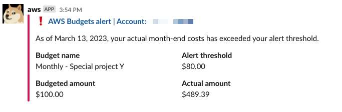

🥳Voila! You’re done setting up a monthly budget threshold notification. Read on to learn more alert patterns you can implement to keep an eye on your cloud spending. 
* * *

## Daily Spending Report

You can share a daily spending report with your team via Slack. This can be help you get comfortable with your daily cloud consumption and also give you early notice if something changes. The user interface will look nearly the same as for the monthly alert we set up earlier, so here we will simply explain what to do and show you an example of the output.

1. Navigate to the AWS Billing Dashboard
2. Choose **Budgets**, then choose **Create budget**
3. Select **Customize (advanced)** and **Cost budget (recommended)**, then choose **Next.**
4. Give your budget a unique, descriptive name like “Daily - Project Y”
5. Under **Set budget amount**
    1. Choose **Daily** from the Period drop-down
    2. Choose **Recurring budge**t as the **Budget renewal type**
    3. Set the **Start date** as the current date
    4. Under **Enter your budgeted amount **enter an estimated daily budget. For example, if your monthly budget is $100.00, then about $3.00 ($100.00 / 30 days in a month) is a good value here.  It’s not critical to be precise.
    5. Choose **Next** to move to the next page
6. Choose **Add an alert threshold**, then:
    1. Set the threshold to **0%**. This will trigger the alert if your cloud spend is over $0.00. 
    2. Under Amazon SNS Alerts, copy and paste in the ARN for your SNS topic
7. Choose **Next**, then choose **Create budget** on the Review screen.

If you have any active spend on your account, you should get a Slack message that looks like this.
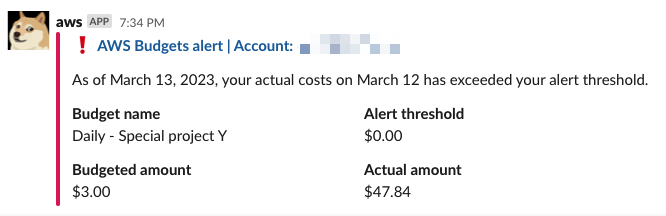
* * *

## Mobile Push Notifications with Pushover

If you’ve ever asked yourself whether you would like more push notifications on your phone, and would like to get one when your AWS budget threshold has been exceeded, there is a straightforward solution using a platform called [Pushover](https://pushover.net/). 

Pushover is a managed notifications service that takes care of the many, many details involved in setting up push notifications. It has a mobile app that is available on the [Apple](https://apps.apple.com/us/app/pushover-notifications/id506088175?ls=1) (iOS) and [Google Play](https://play.google.com/store/apps/details?id=net.superblock.pushover&pli=1) (Android) app stores. 
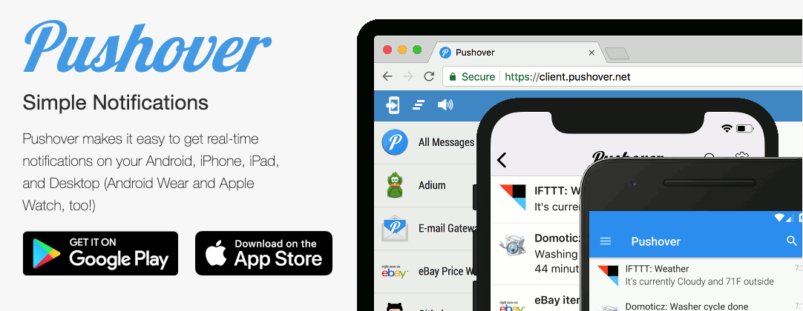

The app is not free - it costs (at the time of this article) $4.99 for a perpetual license. If you’ve ever gone through the process of getting an app in a major app store or operated a push notification service, you will probably agree that 5 bucks is worth the portion of your existence you would dedicate to replicating Pushover. 

### Get Pushover

Sign up for a free Pushover account at https://pushover.net/. Make sure to validate your email address. Next, download the app to your mobile device. It has a 30-day trial so you don’t have to worry about paying yet. 

### Configure Pushover

Open the Pushover app on your mobile device. Log in using your Pushover account. Then, select the settings menu, which is highlighted in the figure below. 
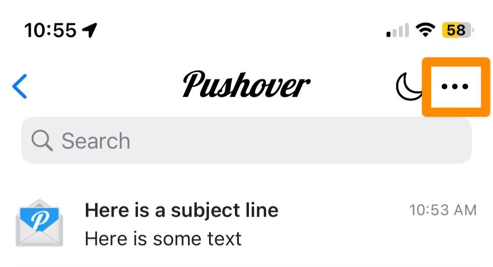

### Configure AWS Billing Dashboard

After you have opened the Settings page, you will see two interesting-looking configuration fields. Your **Pushover User Key**, which we will not use in this example, is for [programmatically sending messages](https://pushover.net/api) to Pushover. Instead, we’re going to use your **Pushover Email Alias**. This is a special email inbox that turns email addressed to it into push notifications on your mobile device. 
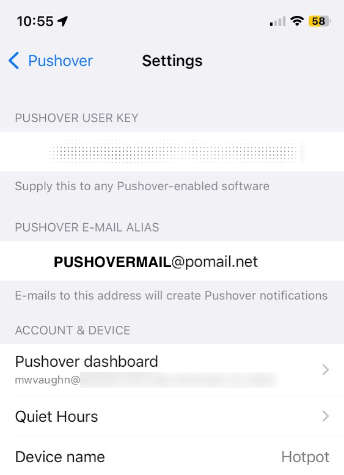

Go to the [AWS Billing Dashboard](https://console.aws.amazon.com/billing/) and select a budget, such as the one you created for this tutorial. Choose **Edit** to change the budget’s configuration. Navigate to the **Configure alerts** page for the budget. Add your Pushover Email Alias to the budget email recipients field. Then, save your changes to the budget. 
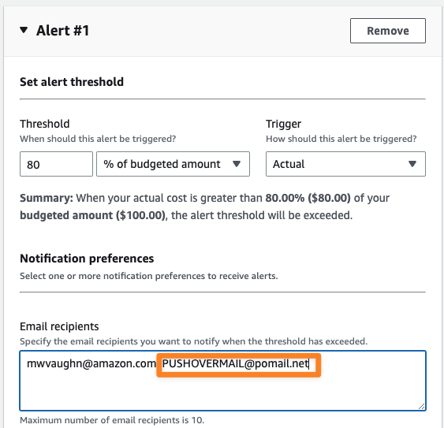

### Receive Push Notifications

The next time a budget notification is triggered, you will get a mobile notification via the Pushover app. Depending on your phone operating system and notifications settings, it will look something like this example. Selecting the message will take you to the Pushover app where you can read its full contents. 
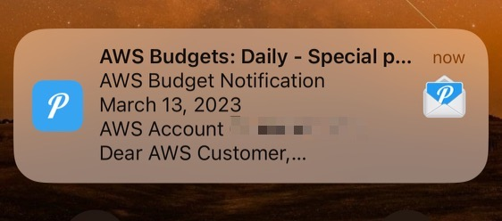

You probably don’t want daily push notifications from AWS, so we recommend that you use this pattern for your most high urgency communications. For example, set it up to trigger when your spend is close to exceeding its budget. That way you can go take action, such as deactivating some AWS resources.  

## Summary and Next Steps

This tutorial has shown you the basics of setting up AWS Billing Dashboard budgets and alerts to send messages with email, Slack, and mobile push notifications. There are many other things you can do with the tools we’ve shown you. Some examples include:

* Sign up for detailed Budget report emails
* Set up other kinds of budgets
* Integrate with Microsoft Teams or Amazon Chime
* Take advantage of integrations with third-party services
* Script actions to take place in your account using AWS Lambdas

We would be delighted to hear how you’re using the knowledge you learned in this tutorial to manage your cloud spending. Reach out to us at [ask-hpc@amazon.com](mailto:ask-hpc@amazon.com)!
